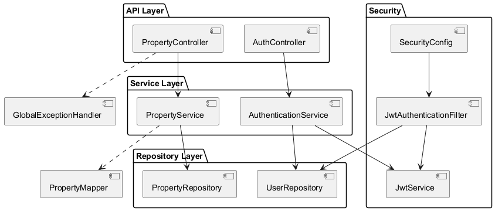
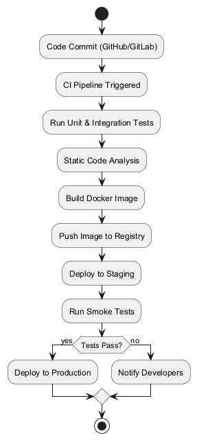

# Architecture_ReadMe.md

## 1. Main Components/Services and Their Responsibilities

The Property Listing Service is structured as a modular Spring Boot application with clear separation of concerns. The main components/services are:

- **Controller Layer**: Handles HTTP requests and responses. For example, `PropertyController` manages property-related endpoints, and `AuthController` manages authentication.
- **Service Layer**: Contains business logic. `PropertyService` handles property management operations, and `AuthenticationService` manages authentication logic.
- **Repository Layer**: Interfaces with the database using Spring Data JPA. `PropertyRepository` and `UserRepository` provide CRUD and query operations.
- **Model/Entity Layer**: Defines the data structures persisted in the database, such as `Property` and `User`.
- **DTOs and Mappers**: Data Transfer Objects (DTOs) like `PropertyRequest` and `PropertyResponse` decouple API contracts from internal models. `PropertyMapper` (MapStruct) handles conversions.
- **Security Layer**: Implements authentication and authorization using JWT, with classes like `JwtService`, `JwtAuthenticationFilter`, and `SecurityConfig`.
- **Validation**: Custom and standard validation annotations ensure input correctness.
- **Exception Handling**: `GlobalExceptionHandler` provides centralized error handling for REST APIs.

### SwitchX - Test: Component/Service Relationships

---

## 2. Security by Design Principles

**Authentication**:  
- JWT-based authentication is implemented. Users authenticate via `/api/v1/auth/authenticate` and receive a JWT token.
- The `JwtAuthenticationFilter` validates tokens on protected endpoints.

**Authorization**:  
- Endpoints are secured using Spring Security. Only authenticated users can perform write operations (create, update, delete).
- Read operations (GET) are permitted for all, as configured in `SecurityConfig`.

**Data Protection**:  
- Passwords are hashed using BCrypt (`PasswordEncoder`).
- Sensitive configuration (DB credentials, JWT secret) is externalized and can be managed via environment variables.

**Secure Communication**:  
- The application is ready for SSL/TLS (see commented SSL config in `application.properties`). In production, HTTPS should be enforced.
- Docker and Kubernetes deployments should use secure networks and secrets management.

**Input Validation**:  
- DTOs use Jakarta Bean Validation annotations (e.g., `@NotBlank`, `@Email`, `@ValidPassword`).
- Custom validators (e.g., `ValidPassword`) enforce strong password policies.
- Validation errors are handled globally and return meaningful error messages.

---

## 3. Error Handling, Logging, and Monitoring

**Error Handling**:  
- Centralized via `GlobalExceptionHandler`, which maps exceptions to structured error responses with appropriate HTTP status codes.
- Handles validation errors, resource not found, and generic exceptions.

**Logging**:  
- Uses SLF4J with configurable log patterns and levels.
- Logs authentication attempts, errors, and important events.
- Logback configuration can be extended for file rotation and external log aggregation.

**Monitoring**:  
- Spring Boot Actuator exposes health, info, metrics, and Prometheus endpoints.
- In production, actuator endpoints are exposed on a separate port (`8081`) for secure monitoring.
- Integration with Prometheus/Grafana is supported for advanced monitoring.

---

## 4. Deployments and CI/CD Approach

**Deployment**:  
- Dockerized for consistency across environments.
- Supports multi-stage builds for optimized images.
- Production uses PostgreSQL (via Docker Compose), while development/testing uses H2.

**CI/CD**:  
- Recommended to use GitHub Actions, GitLab CI, or Jenkins.
- Pipeline steps:
  1. Build and test (unit + integration)
  2. Static analysis (e.g., Checkstyle, SonarQube)
  3. Build Docker image
  4. Push to registry
  5. Deploy to staging/production (Kubernetes, Docker Compose, or cloud PaaS)

### SwitchX - Test: CI/CD and Deployment Flow

---

## 5. Potential Bottlenecks and Mitigation Strategies

- **Database Performance**:  
  - Bottleneck: Large data volumes or inefficient queries.
  - Mitigation: Use proper indexing, optimize queries, and enable connection pooling (HikariCP).

- **Authentication/Authorization**:  
  - Bottleneck: JWT validation or user lookup.
  - Mitigation: Cache user details, keep JWT stateless, and avoid DB calls on every request.

- **API Scalability**:  
  - Bottleneck: High concurrent requests.
  - Mitigation: Use stateless services, horizontal scaling (Kubernetes), and load balancing.

- **Logging Overhead**:  
  - Bottleneck: Excessive or synchronous logging.
  - Mitigation: Use async logging and log aggregation tools (ELK, Loki).

- **Startup Time**:  
  - Bottleneck: Slow dependency initialization.
  - Mitigation: Profile startup, lazy-load beans where possible.

- **Actuator/Monitoring Exposure**:  
  - Bottleneck: Unsecured actuator endpoints.
  - Mitigation: Restrict actuator endpoints to internal networks and secure with authentication.

---